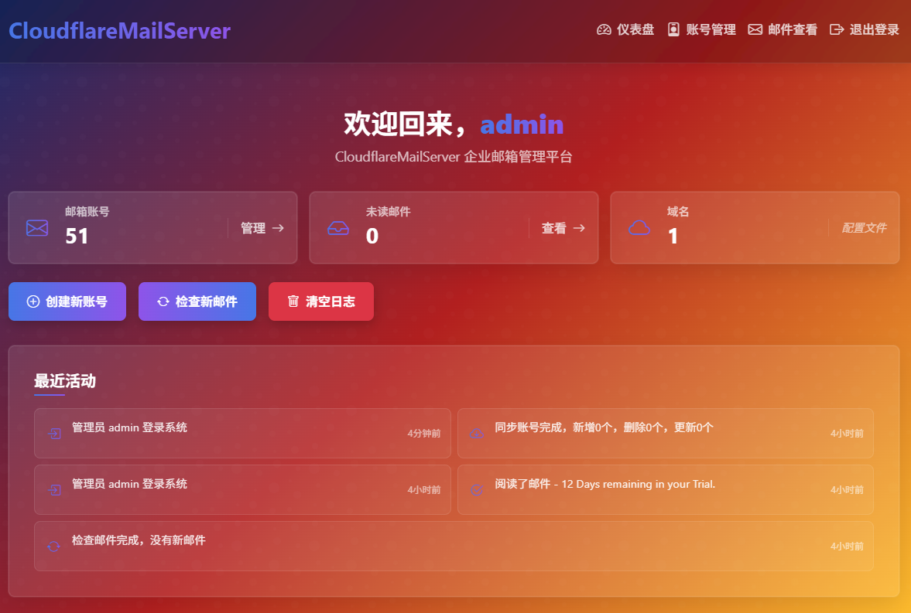
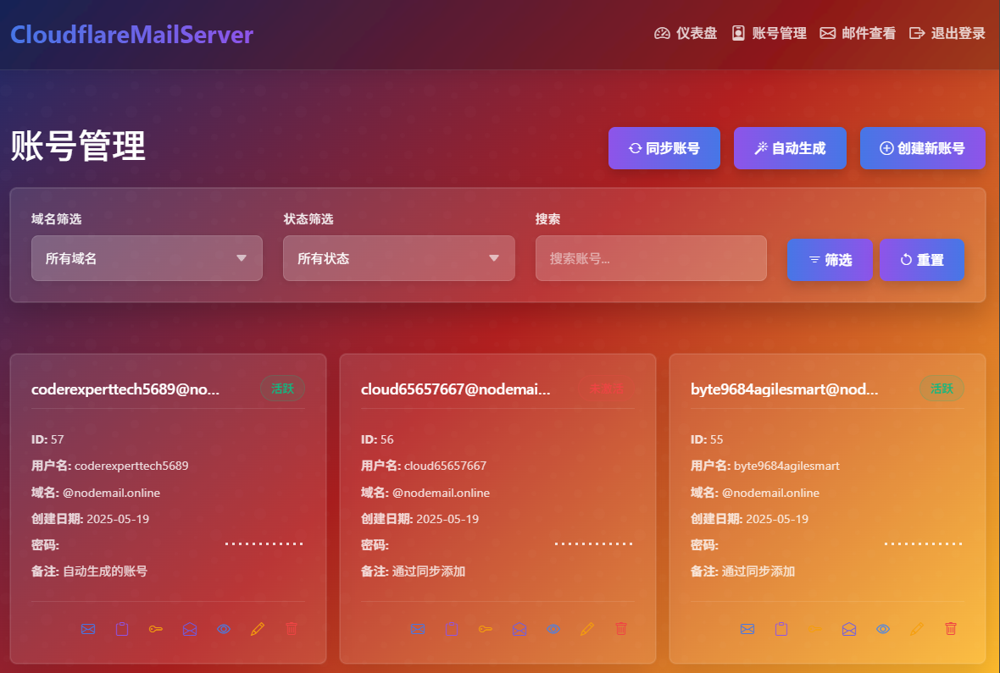
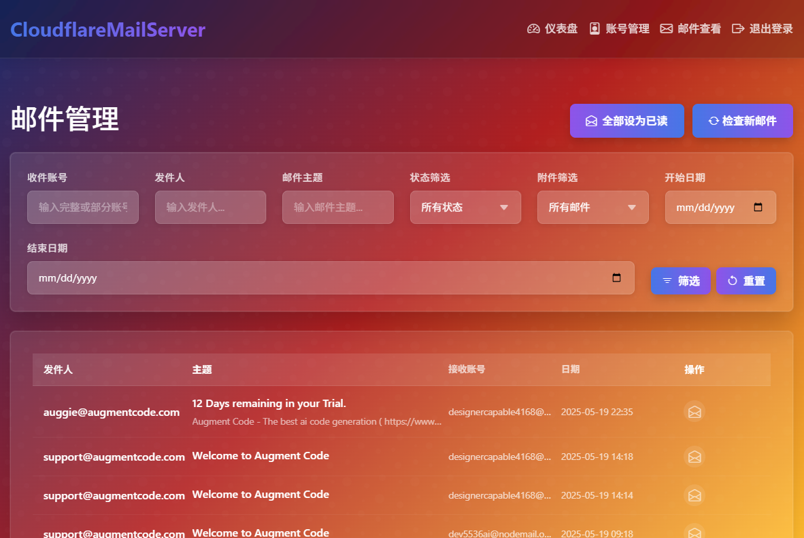

# CloudflareMailServer - 开源高效的企业邮箱与API管理平台

## 项目概述

CloudflareMailServer是一个基于Cloudflare Email Routing和Node.js的开源企业邮箱管理平台。该系统允许管理员通过简洁的Web界面管理多个邮箱账号（如account_name@domain.com），并直接通过IMAP协议查看和处理这些邮箱的邮件。系统不存储邮件内容，而是作为一个代理，直接连接到第三方邮件服务（如Gmail）来获取和显示邮件。账号管理直接基于Cloudflare的邮件路由配置，添加或删除账号会直接修改Cloudflare的转发规则。系统使用SQLite数据库进行本地数据存储，适合个人或小型团队管理多个企业邮箱账号。

## 文档

详细的文档在`doc`目录中提供：

- [安装文档](doc/installation.md) - 详细说明系统的安装与部署方法，包括前提条件和常见问题排查
- [配置文档](doc/configuration.md) - 详细说明系统配置文件的各项参数和配置方法
- [API接口文档](doc/api.md) - 提供系统所有API的详细说明，包括认证、账号管理和邮件操作等
- [使用说明](doc/usage.md) - 提供系统的基本使用指南，包括系统概述、功能说明和常见操作流程
- [Cloudflare邮箱设置指南](doc/cloudflare-email-setup.md) - 详细说明如何配置Cloudflare电子邮件路由和Gmail

## 系统截图

### 仪表盘


### 账号管理


### 邮件管理


## 技术栈

- **后端框架**: Express.js
- **数据存储**: SQLite数据库
- **模板引擎**: EJS
- **认证**: JWT认证和基于会话的Web认证
- **日志**: 自定义日志系统
- **配置管理**: YAML配置文件
- **邮件路由**: Cloudflare Email Routing API
- **邮件处理**: IMAP/SMTP客户端
- **账号管理**: Cloudflare API
- **Web界面**: 响应式设计的管理后台

## 系统架构

系统主要由以下几个部分组成：

1. **服务器核心** (server.js): 负责初始化Express应用、配置中间件、启动HTTP服务器
2. **Web界面** (routes/): 处理Web界面路由，包括管理后台和邮件查看界面
3. **API路由** (api/): 处理所有API请求，包括账号和邮件相关操作
4. **工具模块** (utils/): 提供各种辅助功能，如日志记录、配置管理、邮件处理等
5. **Cloudflare集成** (utils/cloudflare-email-router.js): 与Cloudflare API交互，管理邮件路由规则
6. **视图模板** (views/): EJS模板文件，用于渲染Web界面
7. **静态资源** (public/): 提供前端页面和静态资源
8. **邮件处理** (utils/mail-service.js): 通过IMAP/SMTP协议与第三方邮件服务交互
9. **数据存储** (utils/database.js): 管理SQLite数据库连接和操作

## 功能模块

### 1. 账号管理

- 账号列表：从Cloudflare获取并显示所有邮件转发规则
- 账号创建：在Cloudflare创建新的邮件转发规则
- 账号删除：删除Cloudflare中的邮件转发规则
- 账号信息：本地存储账号的额外信息（如备注等）

### 2. 邮件处理

- 邮件列表：通过IMAP获取指定账号的邮件列表
- 邮件查看：通过IMAP直接查看第三方邮箱中的邮件内容
- 邮件发送：通过SMTP直接发送邮件
- 附件查看：查看邮件附件（不下载到本地服务器）
- 定时拉取：后台定时拉取新邮件

### 3. Web管理界面

- 仪表盘：显示邮箱使用统计和系统状态
- 账号管理：管理Cloudflare邮件转发规则
- 邮件查看：通过IMAP浏览邮件
- 系统设置：配置IMAP/SMTP和Cloudflare连接参数
- 用户认证：基于JWT的用户登录和会话管理

### 4. API接口

- 账号API：提供账号创建和删除功能
- 邮件API：提供邮件列表和邮件内容获取功能
- 验证API：基于JWT的接口认证

## 配置说明

> **重要提示**：在配置系统前，请确保您已完成Cloudflare账号注册、域名验证、Email Routing启用以及API密钥创建等前置工作。详细的前置配置步骤请参考[Cloudflare邮箱设置指南](doc/cloudflare-email-setup.md)。

系统使用`config.yaml`文件进行配置，项目中提供了`config.yaml.sample`作为配置模板。

配置文件包含以下主要部分：
- 服务器配置（端口、监听地址）
- 代理配置（可选）
- Cloudflare配置（API令牌、区域ID等）
- 邮件服务配置（IMAP/SMTP设置）
- 日志配置
- 管理员账号配置
- JWT认证配置
- 登录限制配置

详细的配置说明请参考[配置文档](doc/configuration.md)。

## 安装与部署

CloudflareMailServer的安装与部署非常简单，只需几个步骤即可完成。

### 快速开始

1. 克隆代码库并安装依赖
   ```bash
   git clone https://github.com/chawuciren/cloudflare-mail-server.git
   cd cloudflare-mail-server
   npm install
   ```

2. 配置系统
   - 复制`config.yaml.sample`为`config.yaml`
   - 修改配置文件中的必要参数

3. 初始化数据库并启动服务器
   ```bash
   node utils/init-db.js
   npm start
   ```

4. 访问Web界面
   ```
   http://localhost:3116
   ```

详细的安装与部署说明，包括前提条件、Cloudflare配置、Gmail配置和常见问题排查等，请参考[安装文档](doc/installation.md)。

## 开发指南

### 项目结构

```
cloudflare-open-mail/
├── api/                  # API路由
│   ├── accounts.js       # 账号管理API
│   ├── emails.js         # 邮件管理API
│   ├── auth.js           # 认证API
│   └── routes.js         # API路由入口
├── public/               # 静态资源
│   ├── css/              # 样式文件
│   ├── js/               # JavaScript文件
│   └── img/              # 图片资源
├── routes/               # Web路由
│   ├── accounts.js       # 账号管理页面路由
│   ├── admin.js          # 管理后台路由
│   ├── mail.js           # 邮件查看路由
│   └── routes.js         # Web路由入口
├── utils/                # 工具模块
│   ├── account-generator.js # 账号生成工具
│   ├── auth-middleware.js # 认证中间件
│   ├── cloudflare-email-router.js # Cloudflare邮件路由
│   ├── config.js         # 配置管理
│   ├── database.js       # 数据库连接和操作
│   ├── init-db.js        # 数据库初始化脚本
│   ├── logger.js         # 日志工具
│   ├── mail-service.js   # 邮件服务
│   └── string-helper.js  # 字符串处理工具
├── views/                # EJS模板
│   ├── admin/            # 管理后台视图
│   ├── accounts/         # 账号管理视图
│   ├── mail/             # 邮件查看视图
│   ├── partials/         # 页面组件
│   ├── layout.ejs        # 主布局模板
│   └── index.ejs         # 首页模板
├── data/                 # 数据存储目录
│   └── database.sqlite   # SQLite数据库文件
├── doc/                  # 文档
│   ├── api.md            # API文档
│   └── usage.md          # 使用说明
├── logs/                 # 日志文件
├── config.yaml           # 配置文件
├── config.yaml.sample    # 配置文件示例
├── package.json          # 项目依赖
├── README.md             # 项目说明
└── server.js             # 服务器入口
```

### 开发模式

使用以下命令启动开发模式，支持代码修改自动重启：

```bash
npm run dev
```

## 安全注意事项

1. **配置文件保护**：确保`config.yaml`文件不会被公开访问，该文件包含敏感信息如API令牌和密码。

2. **API令牌权限**：为Cloudflare API令牌分配最小必要权限，只允许Email Routing和DNS操作。

3. **应用专用密码**：对于Gmail等邮箱，使用应用专用密码而不是主密码。

4. **定期更新密码**：定期更新管理员密码和JWT密钥。

5. **HTTPS部署**：在生产环境中使用HTTPS，可以通过反向代理如Nginx配置SSL。

6. **日志管理**：定期检查和轮换日志文件，确保不会泄露敏感信息。

7. **数据库备份**：定期备份SQLite数据库文件，但确保备份文件安全存储。

## 贡献指南

欢迎对本项目进行贡献！请遵循以下步骤：

1. Fork本仓库
2. 创建您的特性分支 (`git checkout -b feature/amazing-feature`)
3. 提交您的更改 (`git commit -m 'Add some amazing feature'`)
4. 推送到分支 (`git push origin feature/amazing-feature`)
5. 开启一个Pull Request

## 许可证

MIT
