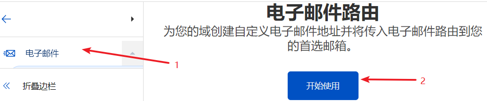
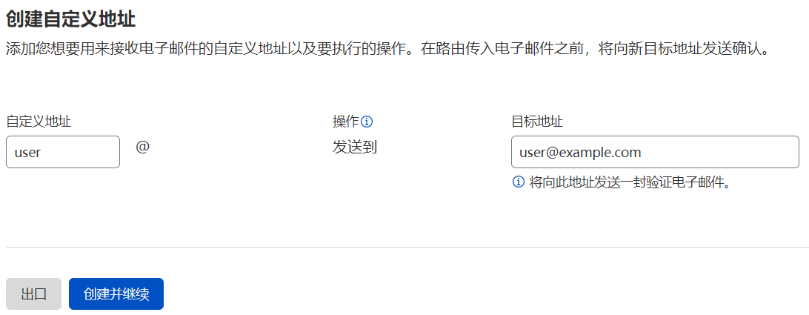
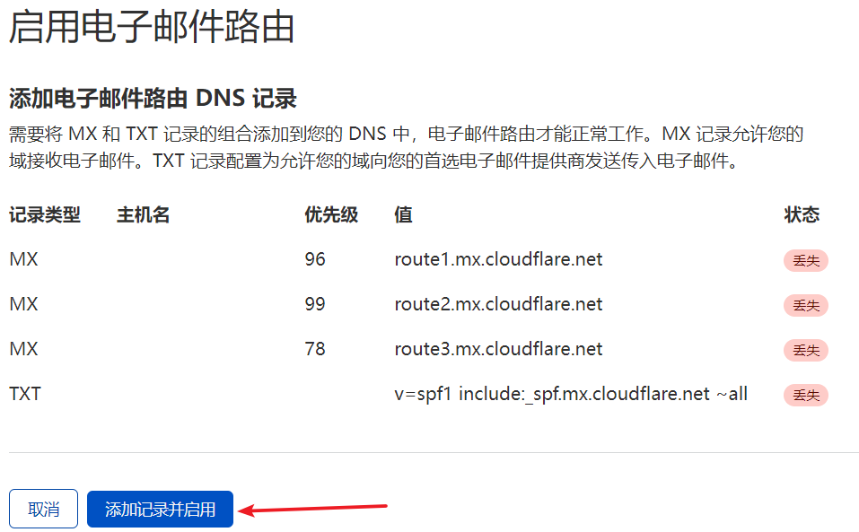
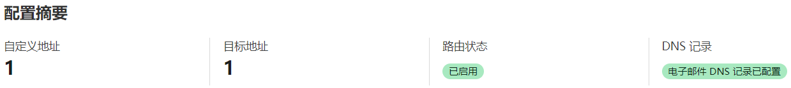
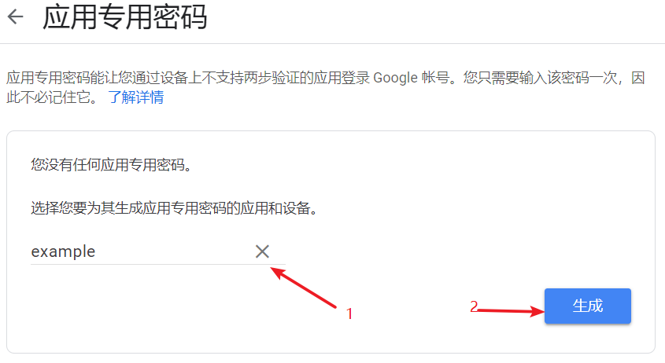
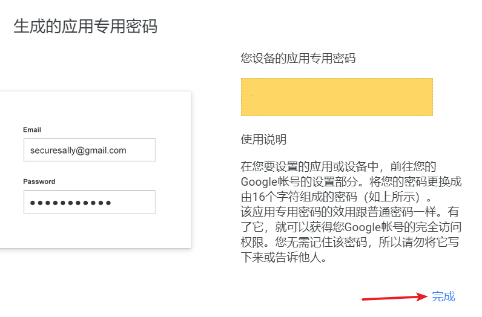
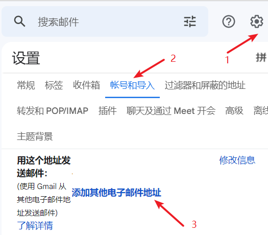
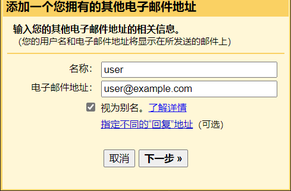
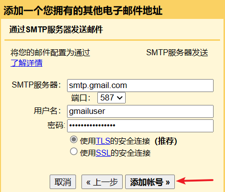
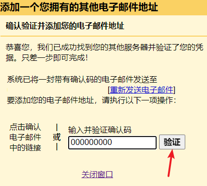

# Cloudflare 邮箱设置指南

本指南将帮助您配置 Cloudflare 电子邮件路由，实现使用个人域名收发邮件。通过 Gmail 作为中转，您可以方便地管理个人域名邮箱。

## 前置准备

- 已在 Cloudflare 上添加了用于收发邮件的站点
- 一个 Gmail 账号
- 个人域名（已托管在 Cloudflare）

## 配置步骤

### 1. Cloudflare 接收邮件设置

1. 登录 Cloudflare 控制面板，点击 `电子邮件` -> `开始使用`：
   

2. 在 `自定义地址` 栏输入邮箱前缀，`目标地址` 栏输入 Gmail 地址，点击 `创建并继续`：
   

3. 如果是新地址，您会收到 `验证电子邮件路由地址` 邮件，点击 `验证电子邮箱地址`。验证成功后，点击 `添加记录并启用`：
   

4. 当显示 `配置摘要` 时，Cloudflare 部分的配置就完成了：
   

### 2. Gmail 发送邮件设置

1. 使用 [Google 应用专用密码](https://myaccount.google.com/apppasswords) 为 Gmail 生成一个密码：
   - 在 `选择应用` 列中选择 `其它（自定义名称）`
   - 填写一个好记的名字（例如邮箱前缀）
   - 点击 `生成`
   

2. 保存生成的 `应用专用密码`，点击 `完成`：
   

3. 打开 Gmail，点击 `设置` -> `查看所有设置` -> [账号和导入](https://mail.google.com/mail/#settings/accounts) -> `用这个地址发送邮件：` -> `添加其他电子邮件地址`：
   

4. 在弹出的窗口中：
   - 在 `名称：` 行输入邮箱名称（**会对外展示，请慎重填写**）
   - 在 `电子邮件地址：` 行输入 Cloudflare 中添加的邮箱地址
   - 点击下一步
   

5. 在 SMTP 服务器设置中：
   - `SMTP服务器：` 输入 `smtp.gmail.com`
   - `用户名` 输入 Gmail 用户名（邮箱不带 `@gmail.com`）
   - `密码` 输入之前保存的 `应用专用密码`
   - 点击 `添加帐号 »`
   

6. Gmail 会发送一封验证邮件，填入验证码并点击 `验证`：
   

## 完成

现在您已经完成了所有配置！您可以：
- 使用个人域名邮箱接收邮件
- 通过 Gmail 发送邮件，发件人显示为您的个人域名邮箱

## 注意事项

- 请妥善保管 Gmail 应用专用密码
- 邮箱名称将作为发件人显示名称，请谨慎设置
- 确保 Cloudflare 域名解析正确配置
